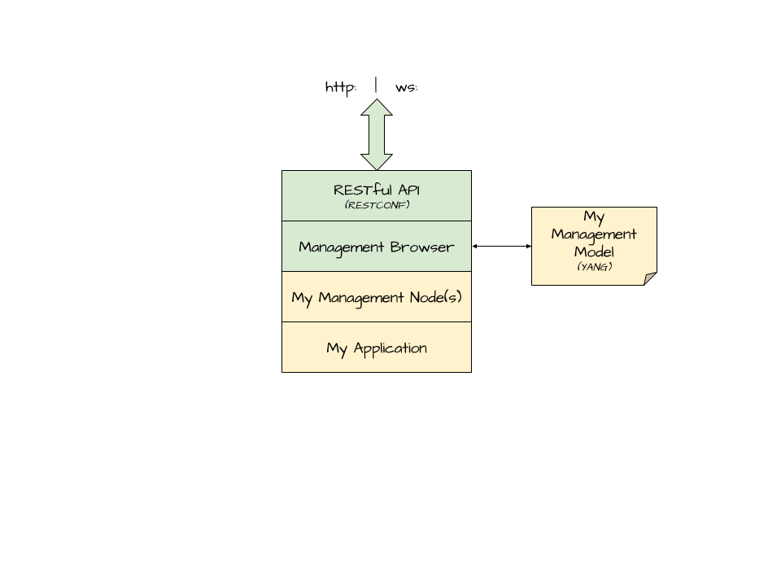

# C2Stack
C2Stack let's you add management capability to any application written in the Go programming language. Manage configuration, metrics, RPCs and events using a RESTful API with web sockets for updates. 

*Standards : [YANG RFC6020](http://tools.ietf.org/html/rfc6020), [RESTCONF RFC8040](https://tools.ietf.org/html/draft-ietf-netconf-restconf-18)*



## Getting Started

Download the source into your project 
 `go get -d -u github.com/ctstack/c2g/...`
 
## Benefits
* No dependencies beyond Go Standard Library
* No code generation or code annotations required
* Simple and flexible
* Includes tools to generate documentation. examples: [car diagram](examples/car/model.svg), [car api](examples/car/index.html)

# Links

* [Questions or problems - StackOverflow](https://stackoverflow.com/questions/ask?tags=c2stack)
* [Source Code - Github](https://github.com/c2stack/c2s)

## License
Licensed under BSD-3-Clause license.

## How to get started with C2Stack

### Step 1. Write your application as normal
You **do not** need to write code that deals with configuration files.

```go
type car struct {
	frontSeat *seat
	owner     string
	...
}

type seat struct {
   ...
}
```

### Step 2. Model your application in YANG
Using your knowledge of your application, you probably have an idea of what data you want configurable, what metrics you want available, what events/alerts you want to communicate and what internal functions you want to make available.  Write a YANG file capturing your model. 

```
model car {
	namespace "";
	prefix "";
	
	container frontSeat {
		description "Front seat of the cat";
		
		/*  more definition about the front seat ... */
	}	
	
	leaf owner { 
		description "Owner of the car";
		type string; 
	}
}
```
 
### Step 3. Write node handlers in C2Stack
Based on your model, you need to write node handlers that map your model to your application.  

```go
import "github.com/c2stack/c2g/node"

func carNode(car *Car) node.Node {
  return &node.MyNode{
  
    // Navigation to other parts of your application based on your model
    OnSelect : func(r node.ContainerRequest) (node.Node, error) {
    	switch r.Meta.GetIdent() {
    	
    	case "frontSeat" :
    		if r.New {
    		   // New is optional, don't implement if your car must have seats
    			car.frontSeat = &carSeat{}
    		}
    		if car.frontSeat != nil {	
    			return seatNode(car.frontSeat)
    		}
    	}
    	return nil, nil
    }
    
    // Read/Write fields.  
    OnField : func(r node.FieldRequest, hnd *node.ValueHandle) error {
    	switch r.Meta.GetIdent() {

    	// node package has handlers that use reflection. Here we'll code this
    	// by hand.
    	case "owner":
    		if r.Write {
    		   // optional : car is changing owners.
    		   car.owner = hnd.Val.Str
    		} if r.Read {
    			// who is the car owner
    			hnd.Val = &node.Value{Str:car.owner}
    		}
    	}
    	return nil
    } 
    
    // For RPCS implement OnAction
    
    // For Events implement OnNotify
    
  }
}
```

### Step 4. Connect everything together

```go
import (
	"github.com/c2stack/c2g/restconf"
	"github.com/c2stack/c2g/meta/yang"
	"github.com/c2stack/c2g/node"
)

func main() {

   // Step 1 - Your app
	car := &Car{}
	
   // Step 2 - Load yang file, hint: leave off .yang file extension
	model := yang.RequireModule(yang.YangPath(), "car")
	
	// Step 3 - Node handler
	data := carNode(car)
	
	// Step 4 part a.) - Connecting everthing together. you can use browser object as a 
	// very powerful way to interact with your application outside the REST api
	bwsr := node.NewBrowser(model, data)	
	
	// Step 4 part b.) - Start RESTful server
	rc := restconf.NewService(yang.YangPath(), bwsr)
	rc.Port = ":8080"
	rc.Listen()
	
	// To run
	//  YANGPATH=path/to/yang/file go run this_file_name.go
	// To test
	//  curl http://localhost:8080/restconf/
}
``` 

## More Examples
* [Car Application](https://github.com/c2stack/c2g/blob/master/examples/car/main.go) - Complete application that manages a car and has web-based user interface.
* [Code Examples](https://godoc.org/github.com/c2stack/c2g/examples) - Mostly examples on node handlers.
* [Example YANG files](https://github.com/c2stack/c2g/tree/master/yang) - Used internally by C2Stack
* [More example YANG files](https://github.com/openconfig/public/tree/master/release/models) - From openconfig.net project